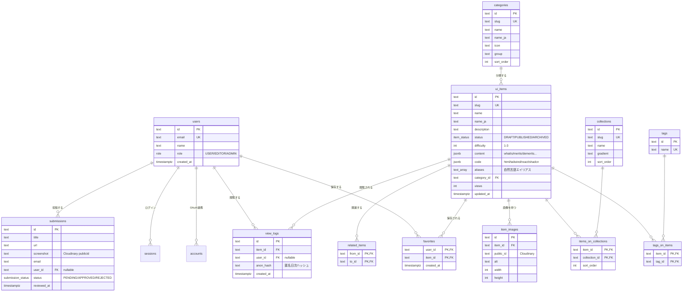

# ER図 — UI Dictionary Japan

## 設計方針

**contentとcodeをJSONBにした理由** — 「UIとは？」「メリット」などの本文セクションは今後増減する可能性が高く、正規化するとマイグレーションコストが本文の柔軟性を上回るためです。検索対象となる `name` / `name_ja` / `aliases` / `description` のみカラムに切り出し、trigram GINインデックスであいまい検索に対応しています。

**view_logsを生ログで持つ理由** — 「直近30日ランキング」「急上昇」など期間集計の要件に応えるため、`ui_items.views`（累計キャッシュ）と `view_logs`（生ログ）の二層構成にしています。ランキングは `v_ranking_30d` ビューで集計し、`views` カラムは日次バッチで同期します。

**匿名閲覧の扱い** — 個人情報を保存せず、IP+UserAgentの日次ソルト付きハッシュ（`anon_hash`）で同一ユーザーの重複カウントを排除します。

**related_itemsが自己多対多の理由** — 「AccordionはTabsと関連」のような対称的な関係を片方向2レコードで表現し、編集画面から柔軟に管理できるようにしています。
